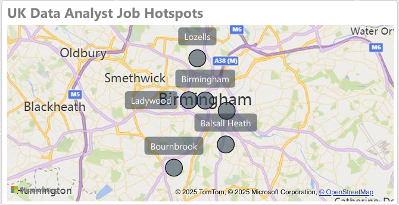

📊 UK Data Analyst Job Market Dashboard – Birmingham Focus (Power BI)

A real-world end-to-end analytics project analyzing Data Analyst job postings in Birmingham, UK.

This project presents a full Power BI dashboard built using real job posting data, enriched with Python-based preprocessing and skill extraction.
It is designed to showcase practical data analysis, BI visualisation, storytelling, and job market intelligence — key skills expected from modern Data Analysts.

🚀 Project Objectives

This project answers critical job market questions:

📌 How many Data Analyst roles are currently available in Birmingham?

📌 What skills are most in-demand?

📌 Which companies hire the most Data Analysts?

📌 What salary ranges do employers offer?

📌 How has job demand changed over time?

The dashboard is designed to support students, job seekers, and career analysts in understanding hiring trends in the UK.

🧩 Dashboard Overview (Power BI)
✔ 1. KPI Summary

Key metrics extracted from postings:

Total Jobs: 47

Average Salary: £48.69K

Jobs with Salary Info: 47

Distinct Cities/Areas: 6

These KPIs give an instant snapshot of the Birmingham data analyst market.

✔ 2. Birmingham Job Hotspot Map

A location-based view showing hiring distribution across areas like:

Birmingham

Bournbrook

Balsall Heath

Ladywood

Lozells
…and more.

This visual highlights local demand clusters across the Birmingham region.

✔ 3. Job Posting Trend Over Time

A line chart displaying monthly job posting activity.

Insight:

Demand dipped between July–October.

A sharp rise occurred in November → 40 job postings.

This helps identify seasonal hiring behaviour.

✔ 4. Top Skills in Demand

Skills extracted and ranked from job descriptions using Python NLP.

Top Skill Mentions:

Power BI (14.9 mentions)

Excel (8.5)

Business Analysis (6.4)

SQL (6.4)

Azure (2.1)

These insights reveal what employers expect from a Data Analyst in Birmingham.

✔ 5. Top Hiring Companies

Most active recruiters include:

TOnlineLearning Recruitment

Network IT

Cooper Moss Rutland

Hays Specialist Recruitment

Michael Page

ITOL Recruit

This helps candidates target the right employers.

🛠 Tech Stack
Power BI

Data modelling

DAX measures

Interactive dashboards

Deloitte-style corporate theme (custom JSON)

Python

Pandas (cleaning, transformation)

Regex + NLP (skill extraction)

Data enrichment

CSV outputs for Power BI

Other Tools

GitHub

Excel

Power Query

📁 Repository Structure
data-analyst-job-market-uk/
│
├── data/
│   ├── raw/
│   └── processed/
│
├── powerbi/
│   ├── dashboard.pbix
│   └── Deloitte_Blue_Theme.json
│
├── screenshots/
│   ├── dashboard_overview.png
│   ├── kpi_cards.png
│   ├── map_skills.png
│   └── companies_trend.png
│
├── notebooks/
│   ├── skill_extraction.ipynb
│   └── data_cleaning.ipynb
│
└── README.md

📸 Dashboard Preview

🔍 Project Workflow

Data Collection

Job postings collected from multiple UK platforms.

Data Cleaning (Python)

Salary standardisation

Date formatting

Null handling

Location extraction

Skill Extraction

Text parsing from job descriptions

Skill dictionary matching (SQL, Python, Excel, Power BI, etc.)

Skill frequency counts

Power BI Modelling

KPI measures

Date modelling

Category hierarchies

Skill bar charts

Company breakdown

Dashboard Design

Corporate Deloitte-style theme

Clean layout

Slicers for City, Contract Type, Skills

Optimised spacing and alignment

🎯 Key Takeaways for Recruiters

Demonstrates strong Power BI dashboard development

Hands-on Python + analytics project execution

Real-world data modelling & data cleaning experience

Ability to extract insights from job market datasets

Focus on career intelligence, valuable for HR / recruitment / analytics roles

📬 Contact

If you're interested in the underlying dataset, methodology, or collaboration — feel free to reach out!

Parth Sharma
Data Analyst & Information Systems Graduate
